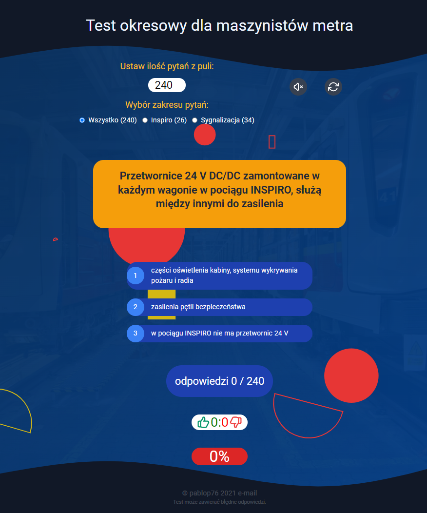

# Aplikacja "Quiz". Testy okresowe na stanowisku maszynista metra

*Test okresowy na stanowisku maszynista metra. 
*Testy odbywaja się co trzy lata. Warunkują utrzymanie przez pracownika "prawa kierowania"

## Technologie uzyte w aplikcji
* react
## Praca z projektem
* Instalacja npm install
* npm start
* deploy
-dodać "homepage": "https://pablop76.github.io/metro-test",
w pliku packed.json
* npm run deploy