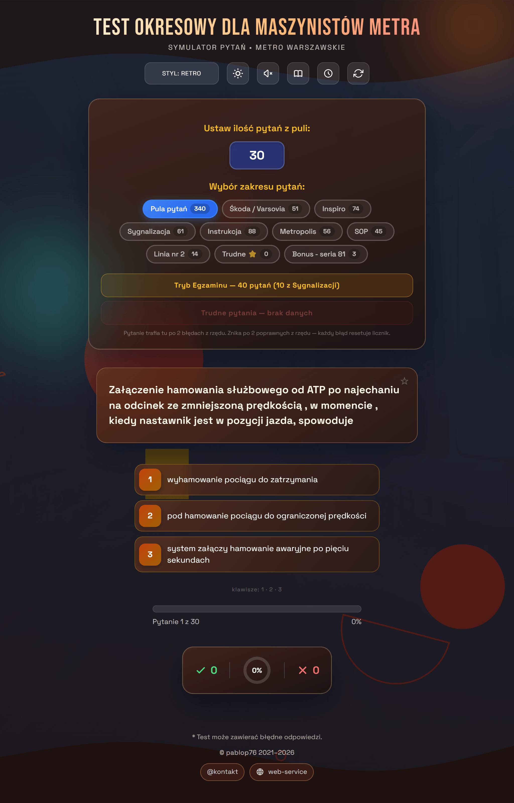

# Aplikacja "Quiz" — Testy okresowe na stanowisku maszynisty metra

Aplikacja online: https://pablop76.github.io/metro-test/



## Krótko
Projekt to aplikacja quizowa w React. Treść pytań bazuje na `public/questions.json`.

## Struktura danych
Każde pytanie ma postać (przykład):

```json
{
  "question": "Treść pytania",
  "content": ["Odpowiedź A", "Odpowiedź B", "Odpowiedź C"],
  "correct": 0,
  "image": "./images/przyklad.png",
  "category": ["inspiro", "skoda", "metropolis", "sop", "sygnalizacja", "instrukcja", "linia2", "81"]
}
```

- `question`: treść pytania
- `content`: tablica odpowiedzi
- `correct`: indeks poprawnej odpowiedzi (0|1|2)
- `image`: opcjonalna ścieżka do obrazka
- `category`: tablica kluczy kategorii (pytanie może mieć wiele kategorii)

Wszystkie dostępne klucze kategorii (przykładowy opis):

| Klucz | Opis |
|-------|------|
| `all` | Wszystkie pytania (domyślna pula; nie zawiera pytań oznaczonych `81`) |
| `inspiro` | Pytania dotyczące pociągów Inspiro |
| `skoda` | Pytania dotyczące pociągów Škoda / Varsovia |
| `metropolis` | Pytania dotyczące pociągów Metropolis |
| `sop` | Systemy SOP / ATP / ATO, bezpieczeństwo ruchu |
| `sygnalizacja` | Semafory, wskaźniki, sygnały i schematy sygnalizacji |
| `instrukcja` | Przepisy, procedury i instrukcje obsługi |
| `linia2` | Specyfika i zasady dla linii M2 |
| `81` | Bonus — "Bonus - seria 81" (oddzielna kategoria, nie domyślnie w `all`) |


UWAGA: istnieje specjalna, bonusowa kategoria o kluczu `81` — `"Bonus - seria 81"`. Pytania oznaczone `81` są traktowane oddzielnie i domyślnie nie wchodzą do puli `all`.

## Multi-wybór kategorii
Interfejs pozwala zaznaczać wiele kategorii jednocześnie. Licznik przy każdej kategorii pokazuje liczbę unikalnych pytań — duplikaty (pytania należące do kilku kategorii) są liczone raz.

## Pauza i wznowienie testu

Postęp testu jest automatycznie zapisywany po każdym pytaniu. Po zamknięciu przeglądarki i powrocie do aplikacji pojawia się przycisk **"▶ Wznów test"** z numerem pytania i godziną zapisu. Wznowienie przywraca dokładny stan — pytanie, wyniki, błędy i tryb.

Zapis jest kasowany gdy test zostanie ukończony lub użytkownik uruchomi tryb egzaminu / trudnych pytań.

## Statystyki sesji

Aplikacja zapisuje historię zakończonych testów w `localStorage` (max 15 sesji). Sesja **nie** jest zapisywana gdy:

- aktywny jest **tryb nauki** (poprawna odpowiedź oznaczona na bieżąco),
- test to **powtórka błędnych odpowiedzi** (uruchamiana przyciskiem po zakończeniu testu),
- aktywny jest **tryb trudnych pytań** (ćwiczenie słabych punktów),
- test zawiera **mniej niż 20 pytań** (zbyt krótki, by był miarodajny).

Do statystyk trafiają tylko pełnowartościowe testy: standardowy test (≥ 20 pytań) oraz tryb egzaminu (40 pytań).

## Uruchomienie lokalne

```bash
npm install
npm start
```

Jeśli port 3000 jest zajęty, CRA zaproponuje inny port.

## Deploy na GitHub Pages

Projekt korzysta z pakietu `gh-pages`. Aby zbudować i opublikować stronę:

```bash
npm run build
npm run deploy
```

**WAŻNE:** aby `gh-pages` poprawnie opublikowało aplikację i aby ścieżki do zasobów działały, w `package.json` musi być ustawione pole:

```json
"homepage": "https://pablop76.github.io/metro-test"
```

Bez tego opublikowana strona może mieć błędne odnośniki do plików CSS/JS i nie działać spod ścieżki `/metro-test/`.

